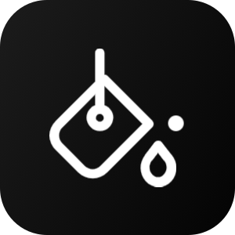

<h1 align="center">DaVinci Paints</h1>

Minimalistic Painting Web App

	
	

  

 

## :pushpin:  Introduction
DaVinci Paints is a minimalistic painting web app.
Which can be used for drawing, as whiteboard, as tool for rough work etc.

LINK: https://omgdahale.github.io/davinci-paints/

## :zap:  Features
Some of the features of DaVinci Paints are:

 - Responsive
 - Minimal
 - Colour picker support
 - Increase brush width with 2 fingers
 - Download as png

## :clap: Supporters

### &#8627; Stargazers

### &#8627; Forkers

 

